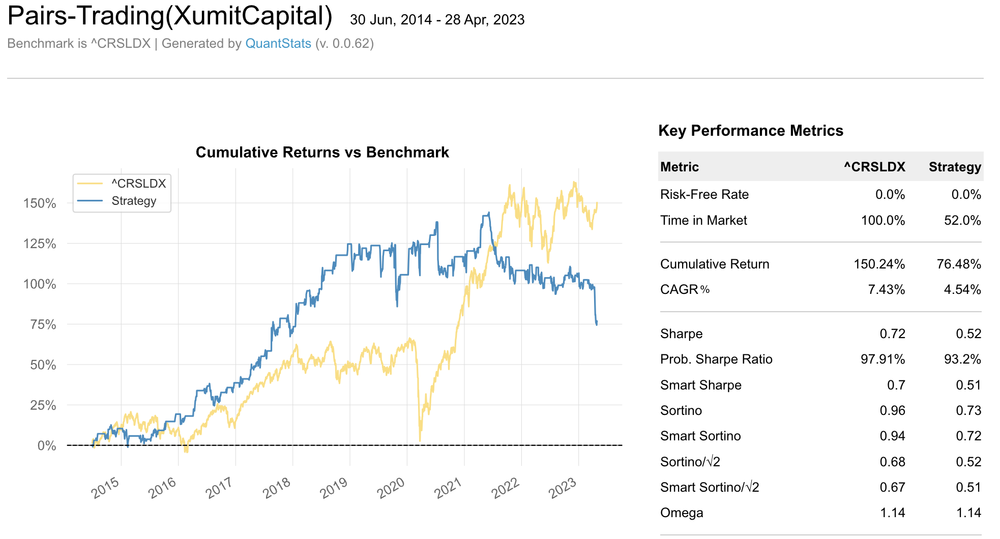

# Portfolio-Optimization Project
A journey to efficient investing, quantum leaps in portfolio strategy.

# Portfolio Strategy Analysis

## Introduction
Welcome to the Portfolio Strategy Analysis repository, where the art and science of investment converge. In the ever-fluctuating world of finance, making informed investment decisions is paramount. This project is dedicated to exploring, analyzing, and comparing a wide array of investment portfolios and their underlying strategies. Whether you are a seasoned investor, a financial analyst, or someone just beginning to navigate the complex world of investments, this repository offers valuable insights into the mechanics and performance of various portfolio strategies.


## Project Objective
The main goal is to dissect and understand how different investment strategies perform under various market conditions. We delve into traditional approaches like lump-sum investing and dollar-cost averaging, as well as more sophisticated strategies employed in modern portfolio theory. By leveraging historical data, analytical tools, and quantitative methods, we aim to provide a comprehensive study that serves as a resource for:

Enhancing investment decision-making processes.
Understanding risk and return dynamics.
Comparing traditional and innovative investment strategies.


By using QuantStats library we can have an enhanced overview of the strategy performance, the technical detail depth is compared with your prefered benchmark investment.
  

## Folder Structure and Contents

- **DCA vs Lump Sum Analysis**:
For an in-depth comparison between Dollar-Cost Averaging (DCA) and Lump-Sum investing strategies, please refer to the dedicated analysis in the [DCA_vs_LumpSum](./src_code/DCA_vs_LumpSum.ipynb) folder.

## Run Project
Activate the Poetry virtual environment:
```commandline
poetry shell
```
Add Poetry library:
```commandline
poetry add <package>
```
Update Poetry dependencies:
```commandline
poetry update
```
Register the virtual environment as a Jupyter kernel:
```commandline
python -m ipykernel install --user --name your-kernel-name
```
Running Jupyter Lab:
```commandline
poetry run jupyter lab
```
Add Dependencies:
```commandline
poetry add pandas numpy scipy matplotlib
```


## Usage

1. Clone the repository to your local machine.
2. Install the required libraries using the provided requirements file.
3. Execute the main script to fetch the data and visualize the simulations.
4. Adjust the parameters in the script to test different investment amounts and periods.

## Contribution

Contributions are highly appreciated! If you have improvements or bug fixes, please:
1. Fork the repository.
2. Make the necessary updates.
3. Create a pull request with a brief description of your changes.

For major changes or features, kindly open an issue first to discuss what you'd like to contribute.

## License

[MIT](LICENSE) (Feel free to add your own license link or details here)
