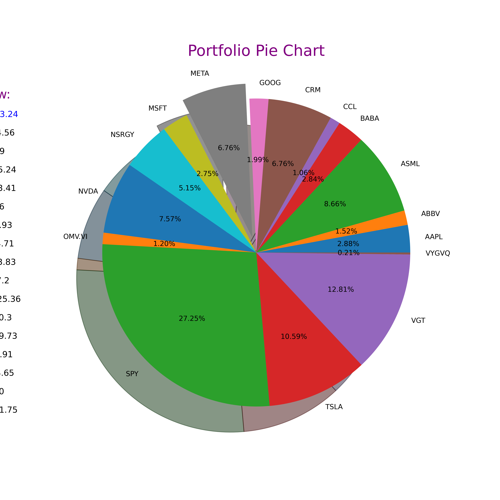

# Portfolios Analysis Notebooks

This directory contains a collection of Jupyter notebooks that form the core of our Portfolio Analysis project. Each notebook is dedicated to a specific aspect of portfolio analysis and strategy comparison

## Notebooks Overview:
1. **Dollar-Cost Averaging VS Lump Sum Strategies**
[DCA_vs_LumpSum](./DCA_vs_LumpSum.ipynb)
In this notebook, we explore the difference between dollar-cost averaging and lump sum investment strategy. It includes a systematic approach of investing a fixed amount periodically and compares its performance against lump-sum investing over S&P500 or (^GSPC on Yahoo finance).
We can see for a fact that for the majority of the time Lump Sum outperforms DCA with more than 70% of the times.

2. **Portfolio Visualization**
[stock_portfolio_visualization](./stock_portfolio_visualization.ipynb) & [stock_portfolio_visualization](./asset_portfolio_visualization.ipynb)
This notebook provides a detailed simulation of lump-sum investing in the S&P 500 index. It demonstrates the growth of a single, one-time investment over a long period, using historical market data.

 

3. **Portfolio Optimization**
[portfolio_optimization](./portfolio_optimization.ipynb)
This notebook provides a detailed simulation of lump-sum investing in the S&P 500 index. It demonstrates the growth of a single, one-time investment over a long period, using historical market data.

4. **Portfolio Risk and Return Analysis**
...

5. **Advanced Portfolio Strategies**
...
