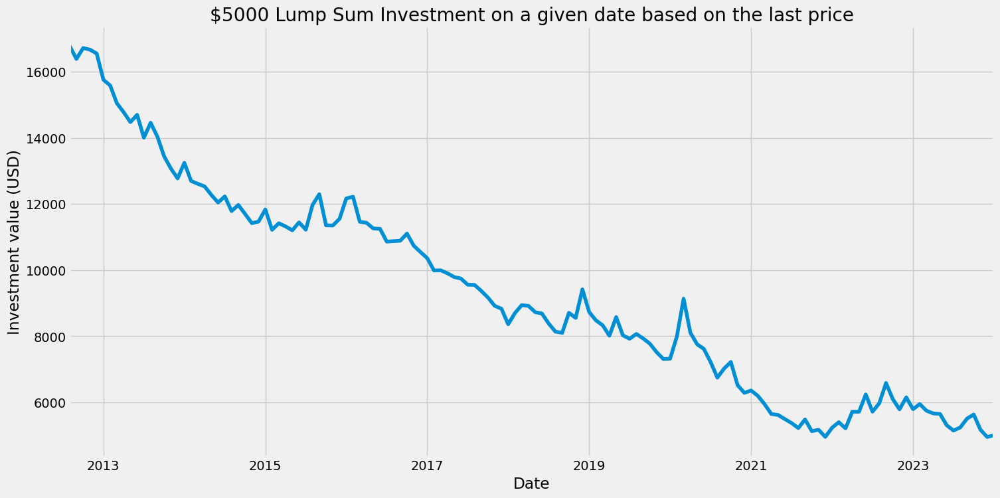
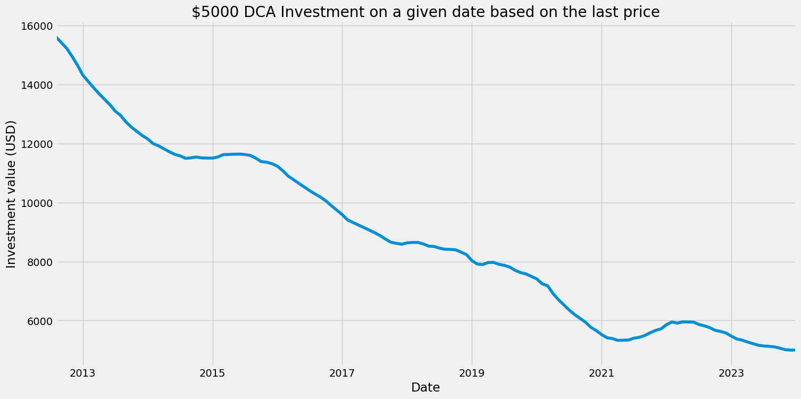
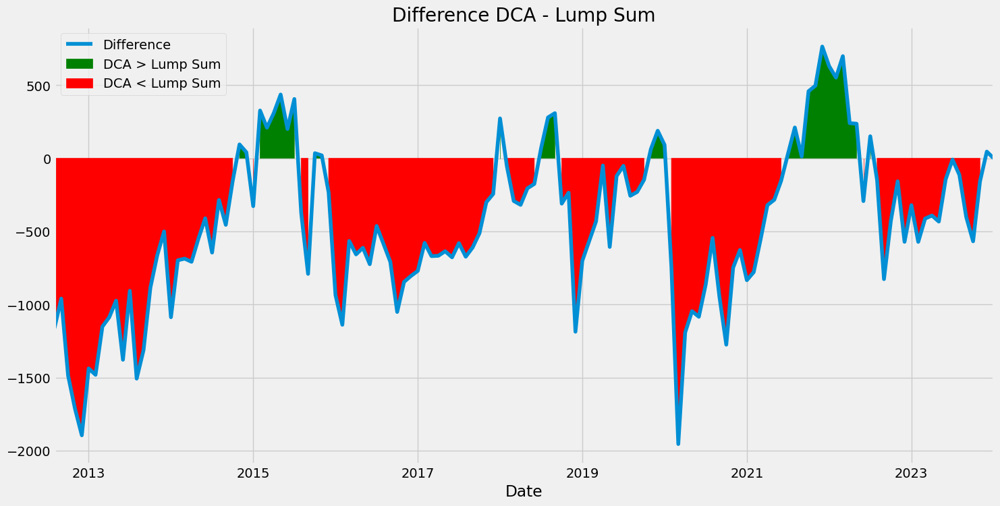

# Portfolios Analysis Notebooks

This directory contains a collection of Jupyter notebooks that form the core of our Portfolio Analysis project. Each notebook is dedicated to a specific aspect of portfolio analysis and strategy comparison

## Notebooks Overview:
1. **Dollar-Cost Averaging VS Lump Sum Strategies**
File: [DCA_vs_LumpSum](./notebooks/DCA_vs_LumpSum.ipynb)
In this notebook, we explore the difference between dollar-cost averaging and lump sum investment strategy. It includes a systematic approach of investing a fixed amount periodically and compares its performance against lump-sum investing over S&P500 or (^GSPC on Yahoo finance).
We can see for a fact that for the majority of the time Lump Sum outperforms DCA with more than 70% of the times.

Lump Sum results with initial investment of $5000 on 1/08/2012.

DCA results with initial investment of $5000 on 1/08/2012 and monthly invesments.

Difference Lump Sum vs DCA

2. **Lump-Sum and DCA Investing Simulatior**
File: Lump_Sum_Investing_Simulation.ipynb
This notebook provides a detailed simulation of lump-sum investing in the S&P 500 index. It demonstrates the growth of a single, one-time investment over a long period, using historical market data.

3. **Portfolio Risk and Return Analysis**
File: Portfolio_Risk_Return_Analysis.ipynb
Here, we analyze the risk and return characteristics of different investment portfolios. The notebook includes calculations of key metrics like volatility, Sharpe ratio, and more.

4. **Advanced Portfolio Strategies**
File: Advanced_Portfolio_Strategies.ipynb
This notebook delves into more sophisticated investment strategies, including modern portfolio theory, and evaluates their performance over various market conditions.
